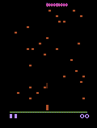

# Centipede AI Project (Deep Q-Network RL)

This project focuses on building an intelligent agent capable of playing the Centipede video game within the Gymnasium (previously openAI Gym) environment with unsupervised learning. The agent selects actions based on a small neural network constructed using TensorFlow and Keras, trained with Deep Q-Network (DQN) reinforcement learning.

## Project Overview

Unlike the original DeepMind paper, which used a shared Convolutional Neural Network (CNN) architecture across all Atari games, I was curious to see if a much smaller NN would accomplish the job in one particular game (if fed rich customized parameters). I chose to extract a custom state consisting of 18 parameters (location of player,spider,centipedes), and this state representation was then fed into a small neural network consisting of only 3 fully connected layers of 64 x 32 x 32 neurons respectively. The architecture of the network was determined through trial and error, aiming for a balance between complexity and performance.

## Training Process

Training the agent was a challenging and iterative process. The Deep Q-Learning algorithm, while powerful, can be finicky to get working optimally. The training process was not linear, and I encountered various obstacles and challenges along the way. It required careful tuning of hyperparameters, exploration strategies, and network architecture to achieve satisfactory performance. A more in-depth analysis can be found in the 'graficos_y_comentarios.ipynb'.

## Results

### Agent Before Training

### Agent After Training

After several nights of training, the best performing agent achieves significantly higher scores than a random agent (~8400 vs ~2500 pts on average). Although the scores are not nearly as good as the ones Deepmind achieved, the agent visibly demonstrates the ability to learn and adapt to the game environment. It correctly learns to follow the centipedes location and avoid spiders, on the other hand it lacks the ability to dodge the centipede once it reaches the bottom. The project serves as a valuable learning experience in reinforcement learning and deep learning, I was surprised with the possibilities that can be achieved with totally unsupervised learning!

## Future Work

In the future, there is potential to further improve the agent's performance by exploring additional reinforcement learning algorithms like experience replay on human games, fine-tuning hyperparameters, or experimenting with CNN architectures. Additionally, integrating advanced techniques such as prioritized replay could enhance the stability and efficiency of the training process.
